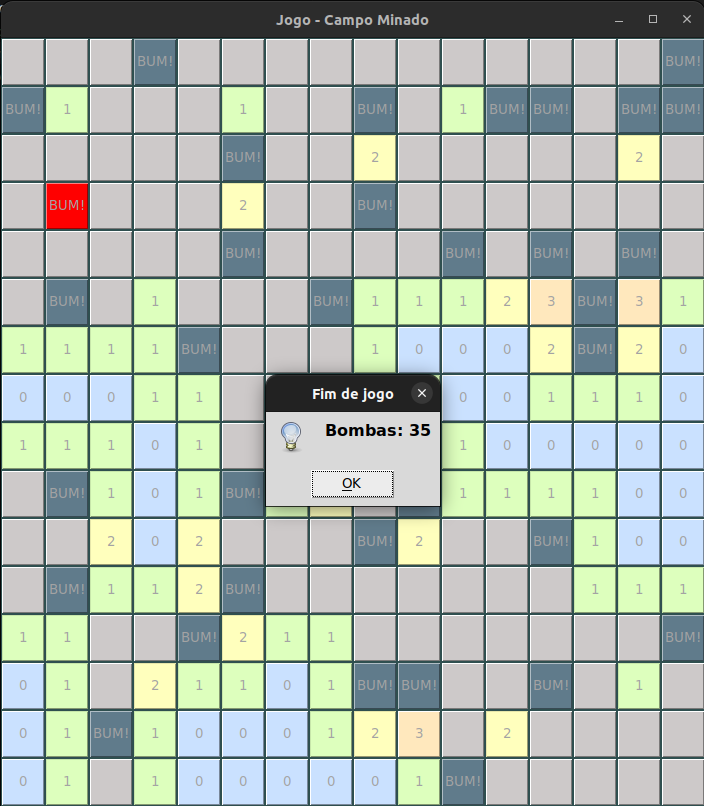
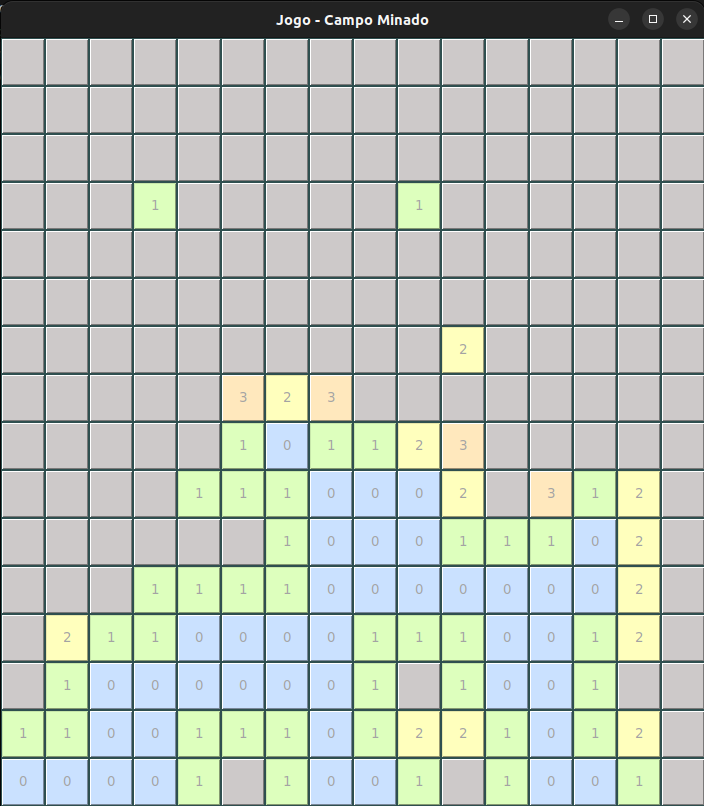

# Criação de um campo minado usando BFS e resolver um exercício do juiz online 

**Número da Lista**: 4 
**Conteúdo da Disciplina**: Grafos 1 

## Alunos
|Matrícula | Aluno |
| -- | -- |
| 19/0046848  |  Laís Portela de Aguiar |

## Sobre 
O objetivo do presente trabalho é construir um jogo Campo Minado, usando uma BFS para revelar células sem minas adjacentes.
Como funciona o jogo: Quando o jogador clicar em alguma célula, será revelado automaticamente as células ao redor que não contém bombas, será revelado também números que indicam quantas bombas tem ao redor. O jogador deverá, com base nisso, definir suas próximas jogadas, com o objetivo de terminar o jogo sem clicar em nenhuma bomba. Para criar as bombas foi usada a função random do python e a biblioteca tk para a interface gráfica.

Também será feito um exercício do URI, do codeforces que pode ser visto no [link](https://codeforces.com/problemset/problem/115/A). O objetivo do exercício é descobrir o número de grupos mínimos que podem ser formados sem ter nenhuma hierarquia de funcionários no mesmo grupo

## Link de apresentação do trabalho

O vídeo de apresentação foi compartilhado no [google drive](https://drive.google.com/file/d/1W17VAPL3iBSIaQxX48n3fUl96UR7Nijk/view?usp=sharing). Por padrão, os videos ficam em baixa qualidade no google drive, para ver na resolução original é só baixar. 

## Screenshots

###  Campo minado: 

- Jogo 1:

    

        
    

    

        
    

    

        
    

    

        
    

- Jogo 2:

    

        
    

    

        
    

    

        
    

    

        
    

**Framework**: tkinter, random 
Para executar o jogo é necessário ter o python instalado juntamente com tkinter

## Uso do Campo Minado
Foi usado o botão executar do vscode para iniciar o jogo

## Instalação para o Exercício do Codeforces 
**Linguagem**: C++ 
**Framework**: g++ 

É necessario ter o compilador instalado na máquina

## Uso Exercício
No ubuntu pode executar o exercício seguindo os seguintes comandos:
g++ -o ex exercicio.cpp
./ex < teste.txt

